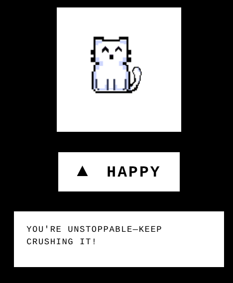
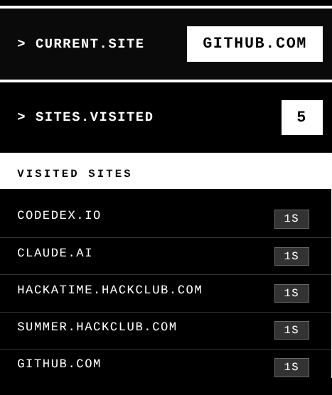

# Pet-o-Meter

Chrome extension that tracks your browsing with a virtual cat. The cat's mood changes based on how productive you are.

## What is pet-o-meter?

Pet-o-Meter watches what sites you visit and shows a cat that reacts to your browsing. Working on productive stuff? Cat gets happy. Wasting time on social media? Cat gets sad. It's like having a real pet but productivity is the food.

## Installation

### Download the Extension

Two ways to download:

**Option A:** Click the green `<> Code` button above, then `Download ZIP`

**Option B:** [Direct download link](https://github.com/istoocold/pet-o-meter/archive/refs/heads/main.zip)

### Extract Files

- Find the ZIP file you downloaded
- Extract it somewhere safe
- Don't delete this folder later or the extension breaks

### Load in Chrome

1. Open Chrome
2. Click Extensions button (puzzle icon, top-right)
3. Click **Manage Extensions**
4. Turn on **Developer mode** (toggle, top-right)
5. Click **Load unpacked**
6. Pick the `pet-o-meter-main` folder
7. Done

### Pin It

1. Click Extensions button again
2. Find Pet-o-Meter
3. Click the pin icon

The icon should show up in your toolbar now.

## How to Use

Just browse normally. The extension tracks stuff in the background. Click the icon whenever you want to check your stats.

## Features

### Cat Mood

Changes every 2 minutes based on what you've been doing:

 
 
 

- **Happy** - being productive (code, docs, learning stuff)
- **Neutral** - mixed browsing (news, random sites)
- **Sad** - wasting time (social media, games, youtube)

### Quote Box

Shows a quote below the cat that matches your productivity. AI generates these to either motivate you or celebrate when you're doing well.

 

### AI Classification

Uses AI to put every site into 3 classes:

- **Class 3** - high productivity (work, learning)
- **Class 2** - medium (news, info)
- **Class 1** - low (fun, social media)

### Time Tracked

Shows total browsing time since you installed it.

### Current Site

Whatever site you're on right now.

### Sites Visited

Click the "SITES VISITED" row to see everywhere you went and how long you spent there. Sorted by most time.

 

### Productivity Bar

Bottom of the popup shows a bar breaking down your time by class:

 

- White = Class 3 (high)
- Striped = Class 2 (medium)
- Grey = Class 1 (low)

Quick way to see how you're spending time.

## Important Stuff

- Keep the extension folder - Chrome needs it
- Browse for a bit before checking - needs data first
- All your data stays local except AI calls to classify sites
- Updates every 5 seconds automatically

## Requirements

- Chrome (or similar like Brave, Edge)
- Internet for AI stuff
- Developer mode on

## Troubleshooting

**Not working?**
- Keep the folder somewhere safe
- Check Developer mode is on at chrome://extensions/
- Try reloading the extension

**Cat won't change mood?**
- Browse different sites for 15-30 seconds each
- Wait 2 minutes between checks
- Need internet for AI
- Or maybe it's just the same mood

**No sites listed?**
- Can't track chrome:// pages
- Click icon after visiting real websites

## Credits

Made with Chrome Extension APIs and Hack Club AI.
